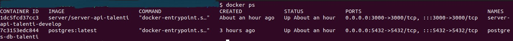

# Talenti Store-Backend

## Features

#### Docker container


## Characteristic
* User login
* JWT storage in NestJs
* Store products in postgreSQL
* All environments are built with docker and docker-compose

## Production environment
* [Production environment](http://localhost:3000/auths/login)

## Testing environment
* [Testing environment](http://localhost:3000/auths/login)

## Starting 🚀

*  These instructions will allow you to obtain a copy of the running project on your local machine for development and testing purposes.

* Look [Talenti Store]() to know the project.

## Usage

#### Directory Structure
```diff

+ ┌── talenti-store
+ | ├── projects
+ | | └── backend
+ | ├── docker-compose.debug
+ | ├── docker-compose.yml
+ | ├── README.md
+ └── env-example

```

## Prerequisites for installation with docker-compose ⚙️

#### Docker Engine

##### Docker Installation On Linux
* [Docker For Linux](https://docs.docker.com/install/linux/docker-ce/ubuntu/)

##### Docker Installation On Windows
* [Docker For Windows](https://docs.docker.com/docker-for-windows/install/)

#### Docker Compose

##### Docker Compose Installation
* [Docker Compose](https://docs.docker.com/compose/install/)

#### Enabling Non-root Users to Run Docker Commands (Optional)
```diff
sudo groupadd docker
sudo gpasswd -a $USER docker
newgrp docker

+ In the case of a virtual machine, it may be necessary to restart the virtual machine for the changes to take effect.

```

## Initialize (In the main directory run this /workspace)

```diff

+ Rename the file found in the root directory ./ example-env to .env

+ Go to directory the projects/backend directory and rename the file example-env to .env
    
+ Go to directory the /workspace and run the following commands from terminal
    docker-compose up --build -d
    docker-compose exec api-server yarn run typeorm:generate-migration
    docker-compose exec api-server yarn run typeorm:run-migrations
    docker-compose exec api-server yarn run seed
    
+ When completing the previous steps we are ready to go to the browser to start using our application go to browser to url http://localhost:3000/auths/login
    User: admin
    Password: admin
```

## Prerequisites for installation conventional ⚙️

#### POSTGRESQL

##### PostgresSQL Configuration On Linux
* [PostgresSQL For Linux](https://www.postgresql.org/download/linux/ubuntu/)

##### Postgres Configuration On Windows
* [PostgresSQL For Windows](https://www.postgresql.org/download/windows/)

## Initialize (In the main directory run this /workspace)

```diff

+ Go to directory the projects/backend directory and rename the file example-env to .env
    Set up a local postgres database and modify the .env file with the connection parameters
    
+ Run the following commands from terminal
    
    1. Install the dependencies
        yarn install
        
    2. Generate the certificates to sign the tokens, enter the `src/auth/certs` folder once inside, execute the following command:
        openssl genrsa -out jwt-private.key 2048 && openssl rsa -in jwt-private.key -pubout -out jwt-public.key
    
    3. Compile the application
        yarn build
    
    4. Generate the migrations
        yarn run typeorm:generate-migration
    
    5. Run the migrations
        yarn run typeorm:run-migrations
    
    6. Run the seeders to create the test data
        yarn run seed
    
+ When completing the previous steps we are ready to go to the browser to start using our application go to browser to url http://localhost:3000/auths/login
    User: admin
    Password: admin
```

## Additional information 📖

#### Crear host
```diff

+ Edit the hosts file of your operating system, adding the ip address of the nginx container and the hostnames example:
    172.18.0.4:3000 local.m.talenti.io

+ In the case of Linux operating system the hosts file is located in the etc directory (/etc/hosts).

```

#### Docker Images
```diff

+ View images
    docker images

+ Remove an image
    docker rmi (imageId o el imageName)

+ Remove all images
    docker rmi $(docker ps -a -q)

```

#### Docker Containers
```diff

+ View containers running
    docker ps

+ View containers stopped and running
    docker docker ps -a

+ Enter a container
    docker exec -ti (containerName o el ContainerId) /bin/sh

+ Stop a container
    docker stop (containerName o el ContainerId)

+ Remove a container
    docker rm (containerName o el ContainerId)

+ Start all containers
    docker start $(docker ps -a -q)

+ Stop all containers
    docker stop $(docker ps -a -q)

+ Turn off all containers
    docker-compose down

+ Remove all containers
    docker rm $(docker ps -a -q)

```

#### SOLID
```diff
+ In this project the 5 SOLID principles were applied:
    S – Single Responsibility Principle (SRP)
    O – Open/Closed Principle (OCP)
    L – Liskov Substitution Principle (LSP)
    I – Interface Segregation Principle (ISP)
    D – Dependency Inversion Principle (DIP)
    
+ Justification:
    All the projects are modulated and the code is reusable, unique responsibilities were delegated to each project, 
    it should be noted that a pagination was missing to list the products but because a demonstration is being carried out, 
    the decision was made to reject the pagination for reasons of times.
```

## Built With 🛠️
```diff
+    NestJs
+    Express
+    PostgreSQL
+    Docker
+    Docker Compose
+    SWagger
```

## Developed Container ✒️
```diff

+    Developed by: Jose Agraz 
+    Email: joseagraz29@gamil.com
```